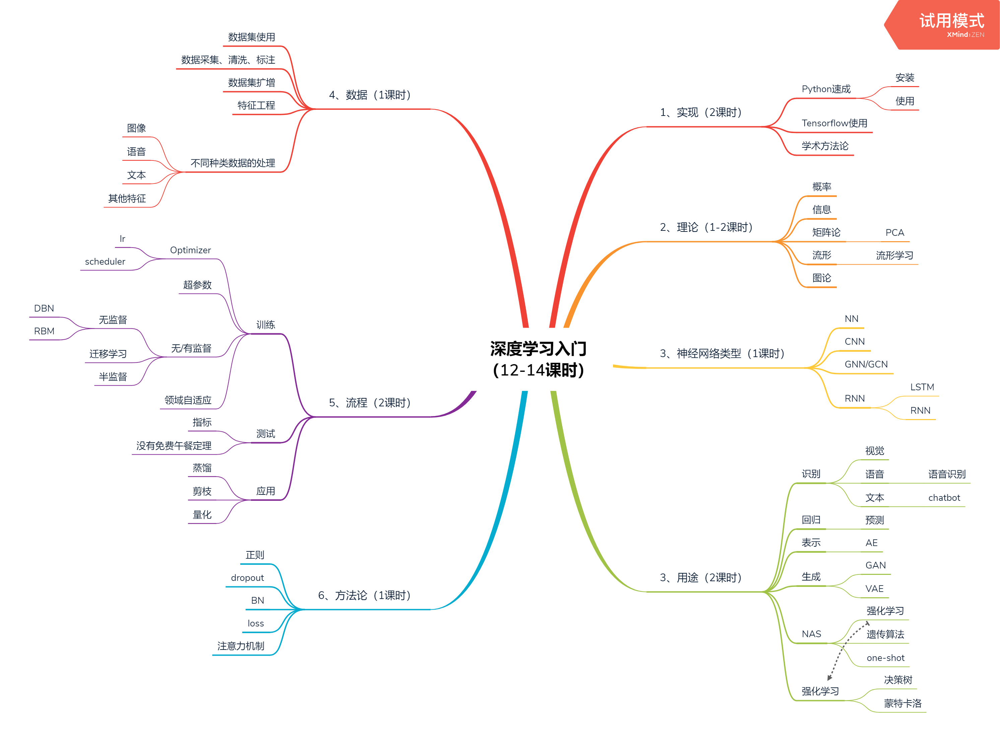

# 深度学习研讨班2019

本项目内容主要是 笃行工作室 __深度学习研讨班2019__ 的课件（`Slides/`）、代码和相关讲义（`Handouts/`）。

## 简介
### 主题
深度学习：理论与实践 
### 主持和参与人员
笃行工作室成员、数学学院学生
### 时间 
事实上只举行了四周，由于参与人数过少而放弃
### 概述
本研讨班主要对象是对深度学习有兴趣但是缺乏相关研究基础的同学，目的是培养适合深度学习科研的人才，让同学们学会将将数学方法和数学工具运用到实际问题的解决中。 
### 形式
- 每次上课前一小时为上次上课内容的讨论，包括答疑和阅读课外参考资料后的感想。 
- 后一小时为授课，由有经验的同学讲授，配有讲义和幻灯片。 
- 课下主要要求同学们阅读相关参考文献、并尝试在计算机上验证相关算法和模型。 
## 内容
### 第一周
- 深度学习绪论 （熊静桦） [[ppt](https://github.com/Duxing-Studio/Deep-Learning-Workshop-2019/blob/master/Slides/week1_2/%E6%B7%B1%E5%BA%A6%E5%AD%A6%E4%B9%A0%E7%A0%94%E8%AE%A8%E7%8F%AD1%20%E7%BB%AA%E8%AE%BA.pptx)]
- Python: 如何快速掌握一门编程语言 (陈卓欣) [[ppt](https://github.com/Duxing-Studio/Deep-Learning-Workshop-2019/blob/master/Slides/week1_python_czx/Python_czx.pdf)] [[讲义](https://github.com/Duxing-Studio/Deep-Learning-Workshop-2019/blob/master/Handouts/Week1_2/Python%E5%9F%BA%E7%A1%80%E6%95%99%E7%A8%8B.pdf)]
- [[课后阅读文献](https://github.com/Duxing-Studio/Deep-Learning-Workshop-2019/blob/master/Handouts/Week1_1/nature14539.pdf)]
### 第二周
- 科研方法论 [[ppt](https://github.com/Duxing-Studio/Deep-Learning-Workshop-2019/blob/master/Slides/week1_1/%E6%B7%B1%E5%BA%A6%E5%AD%A6%E4%B9%A0%E7%A0%94%E8%AE%A8%E7%8F%AD%20101.pdf)] 
- 熵、互信息和最大熵原理 [讲义 
[p1](https://github.com/Duxing-Studio/Deep-Learning-Workshop-2019/blob/master/Handouts/Week2/p1.jpg)
[p2](https://github.com/Duxing-Studio/Deep-Learning-Workshop-2019/tree/master/Handouts/Week2/p2.jpg)
[p3](https://github.com/Duxing-Studio/Deep-Learning-Workshop-2019/tree/master/Handouts/Week2/p3.jpg)
[p4](https://github.com/Duxing-Studio/Deep-Learning-Workshop-2019/tree/master/Handouts/Week2/p4.jpg)
[p5](https://github.com/Duxing-Studio/Deep-Learning-Workshop-2019/tree/master/Handouts/Week2/p5.jpg)
]
- [[课后阅读文献](https://github.com/Duxing-Studio/Deep-Learning-Workshop-2019/blob/master/Handouts/Week2/ON%20THE%20INFORMATION%20BOTTLENECK.pdf)]

### 第三周
- Neural Network:A Selective Overview of Deep Learning [[ppt](https://github.com/Duxing-Studio/Deep-Learning-Workshop-2019/blob/master/Slides/week3/main_empty.pdf)] [[讲义](https://github.com/Duxing-Studio/Deep-Learning-Workshop-2019/blob/master/Slides/week3/main_arxiv.pdf)]

### 第四周
- Application of Deep Learning [[ppt](https://github.com/Duxing-Studio/Deep-Learning-Workshop-2019/blob/master/Slides/week4/main.pdf)]
## 课程大纲

---
[反思](https://mp.weixin.qq.com/s/LiROhS5HVR5ncdBR_2Zr_g)
